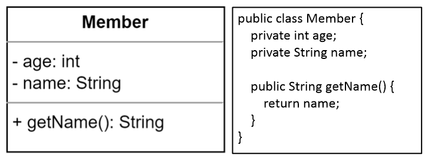

# UML 클래스 다이어그램

## 클래스 다이어그램의 요소

### Class

클래스 이름, 속성, 기능의 3개의 구획(compartment)으로 나누어져 표기된다.  
속성과 기능은 생략이 가능하다. 이름은 필수로 명시해야 한다.  

# 참고
* [넥스트리소프트](https://www.nextree.co.kr/p6753/)
* [UML for Java Programmers](https://www.csd.uoc.gr/~hy252/references/UML_for_Java_Programmers-Book.pdf)
* [sparxsystem](https://sparxsystems.com/resources/tutorials/uml2/class-diagram.html)

