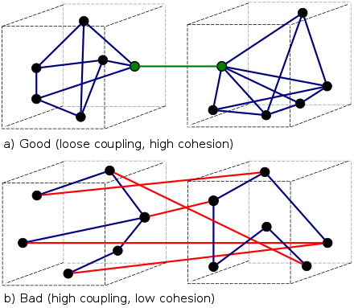

# 응집도와 결합도

## 응집도(Cohesion)



응집도는 모듈 내부 요소들 얼마나 서로 강하게 상호작용 하는가의 여부를 나타낸다.  
일반적으로 응집도는 응집도가 높을수록 잘 설계된 모듈이라고 말한다. 가독성, 신뢰성, 이식성 등이 높기 때문이다. 반면 응집도가 낮은 모듈은 유지보수성, 가독성, 이식성 등이 낮기 때문에 모듈의 응집도를 높이기 위해 노력해야 한다.

## 응집도의 종류

응집도가 낮은 ~ 높은 순서대로 소개한다.

## 우연적 응집도(Coincidental Cohesion) - 가장 낮은 응집도(Bad)

- 모듈 내부 요소들이 별다른 이유 없이 서로 묶여있는 경우.

- 굳이 하나의 모듈에 함께 존재해야 할 이유가 없는 요소들이 함께 묶여있는 경우.
- 그래서 한 눈에 이 모듈이 어떤 기능을 수행하는지 명확히 이해하기 어렵고, 버그를 발생시킬 위험까지 있는 경우.

## 논리적 응집도(Logical Conhesion)

이름만 들으면 응집도가 높아 보인다. 하지만 논리적 응집도는 낮은 응집도를 가진다.  
모듈 내부 요소들이 논리적인 이유로 하나의 모듈 안에 함께 존재하는 경우를 말한다. 예를 들면 로컬 폴더에 이미지 파일을 저장하는 모듈이 있다고 가정해보자. 이 모듈 안에는 **로컬 폴더에 이미지 저장한다** 라는 논리적인 이유가 존재한다. 그렇기 때문에 하나의 모듈 내부에 로컬 폴더에 이미지 파일을 저장하기 위한 각종 기능이 몰려있을 확률이 높다. 이 경우 이 모듈은 논리적 응집도를 가진다고 말할 수 있다.  

## 시간적 응집도(Temporal Cohesion)

기능적 연관성에 상관없이 각 기능 요소들이 특정 시점에 반드시 수행되는 경우.
예를 들면 프로그램이 구동될 때 초기화 시키는 모듈이나 예외 상황이 발생했을 때 오류 로그를 개발자에게 전송하는 기능 등 순서에 상관없는 경우를 말한다. 

## 절차적 응집도(Procedural Cohesion)

모듈 내부 요소들이 **순차적인 처리**에만 관심을 갖는 것이다. 모듈 내부 요소들이 서로 다른 기능을 하지만 그 기능을 순차적으로 수행하는 경우 해당 모듈은 절차적 응집도를 가진다. 따라서 반드시 순서대로 실행되어야 할 필요가 없다면 따로 분리하여 기능적 응집도를 가지도록 해야 한다.

## 통신적/교환적 응집도(Communicational Cohesion)

서롷 다른 기능을 수행하지만 동일한 입력/출력을 사용하는 활동들이 모여 있을 경우.  

## 순차적 응집도(Sequential Conhesion)

모듈 내부 요소들이 서로 의지하여 순차적으로 작동하는 경우를 말한다. 예를 들어 모듈 내부의 한 요소의 출력값이 다른 요소의 입력값으로 사용되는 경우를 말한다.  

```
public void test() {
    String message = getMessage();
    readMessage(message);
}
```

## 기능적 응집도(Functional Cohesion) - 가장 높은 응집도(Good)

모듈 내부의 모든 기능이 하나의 목적을 위해 수행되는 경우.

## 결합도(Coupling)


결합도는 모듈간의 독립성을 의미한다. 모듈이 서로 깊게 연결되어 있으면 결합도가 높은 것이고, 반대인 경우 결합도가 낮다고 말한다.  
결합도는 낮을수록 좋다. 결합도가 낮으면 모듈의 상호의존성이 낮고, 이식성이 높고, 따라서 정보의 흐름이 원활해진다. 

결합도가 높은 ~ 낮은 순서대로 살펴본다.

## 내용 결합도(Content Coupling) - 가장 높은 결합도(Bad)

하나의 모듈이 다른 모듈 내부의 변수나 기능을 사용하는 경우를 말한다. 

## 공통 결합도(Common Coupling)

모듈이 모듈 밖에 있는 전역 변수와 같은 공통 데이터를 참조하는 경우를 말한다. 모듈 밖의 전역 변수와 상호작용을 하면 전역 변수의 변경이 발생했을 경우 해당 변수를 참조한 모듈에 대한 연쇄적인 에러가 발생할 가능성이 매우 높다.

```
class commonCoupling() {
    public int a = 7;

    public void test() {
        // 전역변수 a 참조
    }

    public void test2() {
        // 전역변수 a 참조
    }
}
```

## 외부 결합도(External Coupling)

어떤 모듈에서 반환한 값을 다른 모듈에서 참조해서 사용하는 경우를 말한다.

## 제어 결합도(Control Coupling)

하나의 모듈이 다른 모듈에게 단순한 데이터만 전달하지 않고 제어 명령까지 전달하는 경우를 말한다. 즉 다른 모듈의 내부 논리 흐름까지 제어하는 경우를 말한다. 예를 들면 모듈 A에서 전달받은 결제 여부 확인 값(Boolean 타입)에 따라 모듈 B의 흐름이 바뀌는 경우이다. 

```
public boolean isMemberExist() {
    return true;
}

public void getReceipt() {
    boolean isMember = isMemberExist();
    if (isMember) {
        ...
    } else {
        ...
    }
}
```

## 스탬프 결합도(Stamp Coupling)

두 모듈이 동일한 자료구조를 참조하는 경우를 말한다. 즉 모듈간의 인터페이스로 배열이나 오브젝트 등이 전달되는 경우를 말한다. 자료 구조의 형태가 변경되면 참조하는 모든 모듈에 영향을 미친다.

## 자료 결합도(Data Coupling) - 가장 낮은 결합도(Good)

모듈 간의 인터페이스가 단순한 자료를 통해서 구성될 때의 결합도. 단순한 데이터 타입 형식의 파라미터만 교환하여 상호작용하는 모듈간의 관계를 말한다.

## 참조
https://en.wikipedia.org/wiki/Cohesion_(computer_science)  
https://en.wikipedia.org/wiki/Coupling_(computer_programming)  
https://madplay.github.io/post/coupling-and-cohesion-in-software-engineering